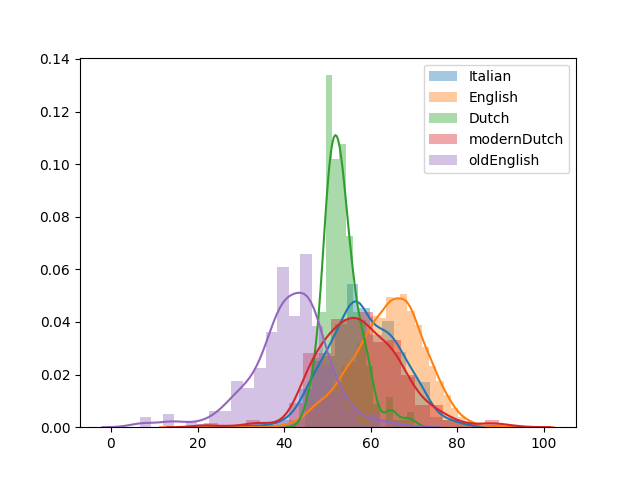

# Table of Contents

1.  [Loading percentages](#orgde7ba37)
2.  [Distributions](#org58b4948)
3.  [Shapiro Test](#org29a1222)
4.  [Welch T-Tests](#orgd4d2f32)
5.  [Mann Whitney U Test](#orgb404797)


<a id="orgde7ba37"></a>

# Loading percentages

```python
    import pickle
    
    italianpercs = open("italianpercs.pickle", "rb")
    italianpercs = pickle.load(italianpercs)
    
    englishpercs = open("englishpercs.pickle", "rb")
    englishpercs = pickle.load(englishpercs)
    
    dutchpercs = open("dutchpercs.pickle", "rb")
    dutchpercs = pickle.load(dutchpercs)
    
    moderndutchpercs = open("moderndutch.pickle", "rb")
    moderndutchpercs = pickle.load(moderndutchpercs)
```

<a id="org58b4948"></a>

# Distributions

```python
    import pickle
    import seaborn as sns
    import matplotlib.pyplot as plt
    
    italianpercs = open("italianpercs.pickle", "rb")
    italianpercs = pickle.load(italianpercs)
    
    englishpercs = open("englishpercs.pickle", "rb")
    englishpercs = pickle.load(englishpercs)
    
    dutchpercs = open("dutchpercs.pickle", "rb")
    dutchpercs = pickle.load(dutchpercs)
    
    moderndutchpercs = open("moderndutch.pickle", "rb")
    moderndutchpercs = pickle.load(moderndutchpercs)
    
    data = {"Italian" : italianpercs, 
    	"English" : englishpercs,
    	"Dutch" : dutchpercs,
    	"modernDutch" : moderndutchpercs}
    
    for x in data.items():
      sns.distplot(x[1], label=x[0])
    
    plt.legend()
    plt.savefig("plotto.png")
    return "./plotto.png"
```



<a id="org29a1222"></a>

# Shapiro Test
```python
    import pickle
    from scipy import stats
    import pylab
    import matplotlib.pyplot as plt
    italianpercs = open("italianpercs.pickle", "rb")
    italianpercs = pickle.load(italianpercs)
    
    englishpercs = open("englishpercs.pickle", "rb")
    englishpercs = pickle.load(englishpercs)
    
    dutchpercs = open("dutchpercs.pickle", "rb")
    dutchpercs = pickle.load(dutchpercs)
    
    moderndutchpercs = open("moderndutch.pickle", "rb")
    moderndutchpercs = pickle.load(moderndutchpercs)
    
    data = {"Italian" : italianpercs, 
    	"English" : englishpercs,
    	"Dutch" : dutchpercs,
    	"modernDutch" : moderndutchpercs}
    
    results = dict()
    
    for x in data.items():
      stats.probplot(x[1], dist="norm", plot=pylab)
      plt.title(x[0])
      plt.savefig("%sQQplot.png" % x[0])
      plt.close("all")
      results[x[0]] = stats.shapiro(x[1])[1]
    
    
    return results
```
<table border="2" cellspacing="0" cellpadding="6" rules="groups" frame="hsides">


<colgroup>
<col  class="org-left" />

<col  class="org-left" />

<col  class="org-right" />

<col  class="org-left" />

<col  class="org-left" />

<col  class="org-right" />

<col  class="org-left" />

<col  class="org-left" />

<col  class="org-right" />

<col  class="org-left" />

<col  class="org-left" />

<col  class="org-right" />
</colgroup>
<tbody>
<tr>
<td class="org-left">Italian</td>
<td class="org-left">:</td>
<td class="org-right">0.420023113489151</td>
<td class="org-left">English</td>
<td class="org-left">:</td>
<td class="org-right">3.952866822370328e-23</td>
<td class="org-left">Dutch</td>
<td class="org-left">:</td>
<td class="org-right">3.278021409869325e-08</td>
<td class="org-left">modernDutch</td>
<td class="org-left">:</td>
<td class="org-right">2.2561225705430843e-05</td>
</tr>
</tbody>
</table>

<table border="2" cellspacing="0" cellpadding="6" rules="groups" frame="hsides">


<colgroup>
<col  class="org-left" />

<col  class="org-left" />

<col  class="org-right" />
</colgroup>
<tbody>
<tr>
<td class="org-left">Italian</td>
<td class="org-left">:</td>
<td class="org-right">0.420023113489151</td>
</tr>


<tr>
<td class="org-left">English</td>
<td class="org-left">:</td>
<td class="org-right">3.952866822370328e-23</td>
</tr>


<tr>
<td class="org-left">Dutch</td>
<td class="org-left">:</td>
<td class="org-right">3.278021409869325e-08</td>
</tr>


<tr>
<td class="org-left">modernDutch</td>
<td class="org-left">:</td>
<td class="org-right">2.2561225705430843e-05</td>
</tr>
</tbody>
</table>


<a id="orgd4d2f32"></a>

# Welch T-Tests

```python 
    import pickle
    
    italianpercs = open("italianpercs.pickle", "rb")
    italianpercs = pickle.load(italianpercs)
    
    englishpercs = open("englishpercs.pickle", "rb")
    englishpercs = pickle.load(englishpercs)
    
    dutchpercs = open("dutchpercs.pickle", "rb")
    dutchpercs = pickle.load(dutchpercs)
    
    moderndutchpercs = open("moderndutch.pickle", "rb")
    moderndutchpercs = pickle.load(moderndutchpercs)
    import seaborn as sns
    from scipy import stats
    import pylab
    
    dutcheng = "DUTCH ENG:\t"+str(stats.ttest_ind(dutchpercs, englishpercs, equal_var=False)[1])
    dutchita = "DUTCH ITA:\t"+str(stats.ttest_ind(dutchpercs, italianpercs,equal_var=False)[1])
    dutchmod = "DUTCH MOD:\t"+str(stats.ttest_ind(dutchpercs, moderndutchpercs,equal_var=False)[1])
    italeng = "ITA ENG:\t"+str(stats.ttest_ind(italianpercs, englishpercs,equal_var=False)[1])
    italmod = "ITA MOD:\t"+str(stats.ttest_ind(italianpercs, moderndutchpercs,equal_var=False)[1])
    engmod = "ENG MOD:\t"+str(stats.ttest_ind(englishpercs, moderndutchpercs,equal_var=False)[1])
    
    return "\n".join([dutcheng, dutchita,dutchmod, italeng, italmod, engmod])
```


```
    DUTCH ENG:	5.066694424377665e-102
    DUTCH ITA:	1.2932607850490275e-28
    DUTCH MOD:	2.863753564928754e-14
    ITA ENG:	6.213336870606083e-44
    ITA MOD:	0.08231180463815092
    ENG MOD:	2.2751970524785925e-36
```

<a id="orgb404797"></a>

# Mann Whitney U Test

```python    
    import pickle
    
    italianpercs = open("italianpercs.pickle", "rb")
    italianpercs = pickle.load(italianpercs)
    
    englishpercs = open("englishpercs.pickle", "rb")
    englishpercs = pickle.load(englishpercs)
    
    dutchpercs = open("dutchpercs.pickle", "rb")
    dutchpercs = pickle.load(dutchpercs)
    
    moderndutchpercs = open("moderndutch.pickle", "rb")
    moderndutchpercs = pickle.load(moderndutchpercs)
    import seaborn as sns
    from scipy import stats
    import pylab
    
    dutcheng = "DUTCH ENG:\t"+str(stats.mannwhitneyu(dutchpercs, englishpercs)[1])
    dutchita = "DUTCH ITA:\t"+str(stats.mannwhitneyu(dutchpercs, italianpercs)[1])
    dutchmod = "DUTCH MOD:\t"+str(stats.mannwhitneyu(dutchpercs, moderndutchpercs)[1])
    italeng = "ITA ENG:\t"+str(stats.mannwhitneyu(italianpercs, englishpercs)[1])
    italmod = "ITA MOD:\t"+str(stats.mannwhitneyu(italianpercs, moderndutchpercs)[1])
    engmod = "ENG MOD:\t"+str(stats.mannwhitneyu(englishpercs, moderndutchpercs)[1])
    
    return "\n".join([dutcheng, dutchita,dutchmod, italeng, italmod, engmod])
```

```
    DUTCH ENG:	1.3717168636704838e-79
    DUTCH ITA:	5.88518398092256e-21
    DUTCH MOD:	6.18417694118659e-11
    ITA ENG:	1.4977812914162474e-49
    ITA MOD:	0.01887171365553699
    ENG MOD:	2.916518520191118e-50
```
